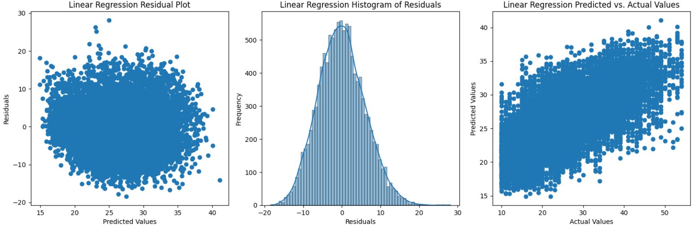

# LHL_final_project

A Food Delivery Company (India) would like to inform its customers of the delivery time once they've ordered through accurate predictive modelling.

## Scope

Operations department of the Food Delivery Company (India) provided a dataset with the desired outcome variable being the time it takes their drivers to deliver once the order has been placed.

## Deliverable: Proof of Concept for future modelling

The the models created with the data given yielded little predictive power, the best being a Linear Regression model with an r2 score of 0.593351.  

If there was more time, I would discuss with operations the ability to measure more accurate metrics.

